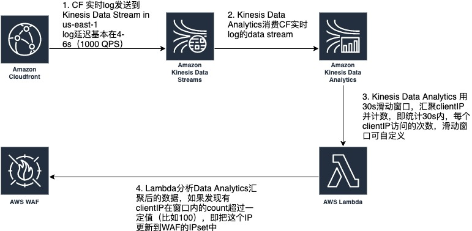

# CloudFront Real-time log analysis 

 - Analyze CloudFront real-time access logs, by Kinesis Data Analytics SlidingWindow/Tumbling Window

 - Using Lambda to get real-time log analysis, to find high rate requesting IP address, and modify WAF rules to block those IP

 

 **Kinesis Data Analytics Sample code**
 ```
 ##Sliding Window

 CREATE OR REPLACE STREAM "DESTINATION_SQL_STREAM" (clientIP VARCHAR(16), clientIP_count INTEGER);
CREATE OR REPLACE PUMP "STREAM_PUMP" AS INSERT INTO "DESTINATION_SQL_STREAM"
	SELECT STREAM CIP, COUNT(*) OVER TEN_SECOND_SLIDING_WINDOW AS clientIP_count
		FROM "SOURCE_SQL_STREAM_001"
		WINDOW TEN_SECOND_SLIDING_WINDOW AS (
   			PARTITION BY CIP
  			RANGE INTERVAL '10' SECOND PRECEDING);


## Tumbling Window

CREATE OR REPLACE STREAM "DESTINATION_SQL_STREAM" (clientIP VARCHAR(16), clientIP_count INTEGER);

CREATE OR REPLACE PUMP "STREAM_PUMP" AS INSERT INTO "DESTINATION_SQL_STREAM"
    SELECT STREAM CIP, count(*) as COUNTIP
        FROM "SOURCE_SQL_STREAM_001"
        -- WHERE COUNTIP > 5
        GROUP BY CIP, 
            STEP("SOURCE_SQL_STREAM_001".ROWTIME BY INTERVAL '10' SECOND);

 ```

**Sample Lambda Code to Get analysis result, and Modify WAF rules**

```from __future__ import print_function
import boto3
import base64
import json

client = boto3.client('sns')
# Include your SNS topic ARN here.
#topic_arn = 'arn:aws:sns:<region>:<account_id>:<topic_name>'
waf = boto3.client('waf')
get_token = waf.get_change_token()
token = get_token['ChangeToken']

ipsetid = '08c77039-3669-40eb-9fe6-989d16f1fc0a'


def lambda_handler(event, context):
    output = []
    success = 0
    failure = 0
    for record in event['records']:
        try:
            # Uncomment the below line to publish the decoded data to the SNS topic.
            payload = base64.b64decode(record['data'])
            print(payload)
            data = json.loads(payload)
            if data["CLIENTIP_COUNT"] > 100:
                ip = data['CLIENTIP'] + '/32'
                print(ip)
                response = waf.update_ip_set(
                    ChangeToken = token,
                    IPSetId= ipsetid,
                    Updates=[
                        {
                            'Action': 'INSERT',
                            'IPSetDescriptor': {
                                'Type': 'IPV4',
                                'Value': ip,
                            },
                        },
                    ],
                )
                print(response)
            #client.publish(TopicArn=topic_arn, Message=payload, Subject='Sent from Kinesis Analytics')
            output.append({'recordId': record['recordId'], 'result': 'Ok'})
            success += 1
        except Exception:
            output.append({'recordId': record['recordId'], 'result': 'DeliveryFailed'})
            failure += 1

    print('Successfully delivered {0} records, failed to deliver {1} records'.format(success, failure))
    return {'records': output}


```